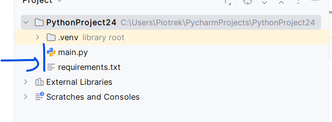
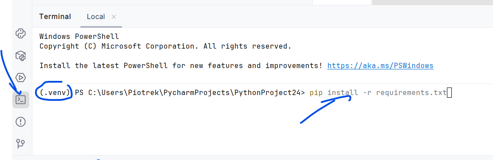

# Konfiguracja

1. W pierwszym kroku tworzymy nowy projekt w wybranej lokalizacji. Wybieramy venv oraz jedną z wersji Pythona np. 3.13. Na koniec przycisk Create.

2. Dodajemy plik z wymaganiami https://piojas.pl/wp-content/uploads/2026/02/requirements.txt do projektu do głównego katalogu. Nazwa pliku jest istotna.

3. Otwieramy terminal w pycharm i wpisujemy komendę: `pip install -r requirements.txt`

