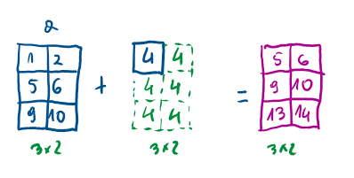
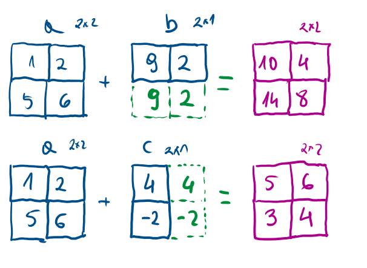
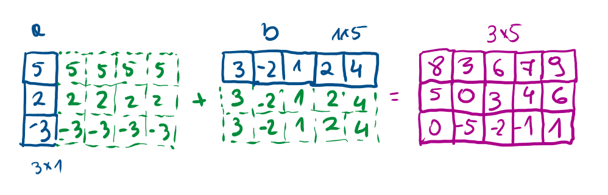

## Broadcasting

Rozważane warianty są przykładowe.

Wariant 1 - skalar-tablica - wykonanie operacji na każdym elemencie tablicy

```{python}
#| echo: true
import numpy as np

a = np.array([[1, 2], [5, 6], [9, 10]])
b = a + 4
print(b)
c = 2 ** a
print(c)

```



Wariant 2 - dwie tablice - "gdy jedna z tablic może być rozszerzona" (oba wymiary są równe lub jeden z nich jest równy 1)

::: {.content-visible when-format="html"}

<https://numpy.org/doc/stable/user/basics.broadcasting.html>

:::
  
```{python}
#| echo: true
import numpy as np

a = np.array([[1, 2], [5, 6]])
b = np.array([9, 2])
r1 = a + b
print(r1)
r2 = a / b
print(r2)
c = np.array([[4], [-2]])
r3 = a + c
print(r3)
r4 = c / a
print(r4)

```



Wariant 3 - "kolumna" i "wiersz"


```{python}
#| echo: true
import numpy as np

a = np.array([[5, 2, -3]]).T
b = np.array([3, -2, 1, 2, 4])
print(a+b)
print(b+a)
print(a*b)
```


