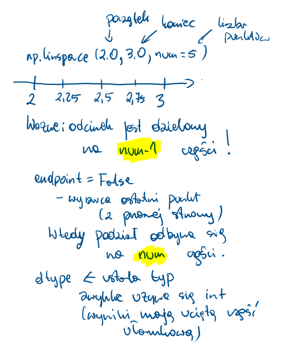
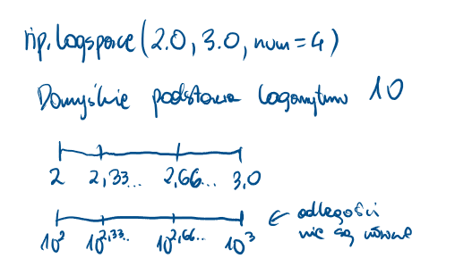

# Tworzenie tablic

`np.array` - argumenty rzutowany na tablicę (coś po czym można iterować) - warto sprawdzić rozmiar/kształt

```{python}
#| echo: true
import numpy as np

tab = np.array([2, -3, 4])
print(tab)
print("size:", tab.size)
tab2 = np.array((4, -3, 3, 2))
print(tab2)
print("size:", tab2.size)
tab3 = np.array({3, 3, 2, 5, 2})
print(tab3)
print("size:", tab3.size)
tab4 = np.array({"pl": 344, "en": 22})
print(tab4)
print("size:", tab4.size)

```

`np.zeros` - tworzy tablicę wypełnioną zerami

```{python}
#| echo: true
import numpy as np

tab = np.zeros(4)
print(tab)
print(tab.shape)
tab2 = np.zeros([2, 3])
print(tab2)
print(tab2.shape)
tab3 = np.zeros([2, 3, 4])
print(tab3)
print(tab3.shape)
```

`np.ones` - tworzy tablicę wypełnioną jedynkami (to nie odpowiednik macierzy jednostkowej!)

```{python}
#| echo: true
import numpy as np

tab = np.ones(4)
print(tab)
print(tab.shape)
tab2 = np.ones([2, 3])
print(tab2)
print(tab2.shape)
tab3 = np.ones([2, 3, 4])
print(tab3)
print(tab3.shape)
```

`np.diag` - tworzy tablicę odpowiadającą macierzy diagonalnej

```{python}
#| echo: true
import numpy as np

print("tab0")
tab0 = np.diag([3, 4, 5])
print(tab0)
print("tab1")
tab1 = np.array([[2, 3, 4], [3, -4, 5], [3, 4, -5]])
print(tab1)
tab2 = np.diag(tab1)
print("tab2")
print(tab2)
tab3 = np.diag(tab1, k=1)
print("tab3")
print(tab3)
print("tab4")
tab4 = np.diag(tab1, k=-2)
print(tab4)
print("tab5")
tab5 = np.diag(np.diag(tab1))
print(tab5)
```

`np.arange` - tablica wypełniona równomiernymi wartościami

Składnia: `numpy.arange([start, ]stop, [step, ]dtype=None)`

Zasada działania jest podobna jak w funkcji `range`, ale dopuszczamy liczby "z ułamkiem".

```{python}
#| echo: true
import numpy as np

a = np.arange(3)
print(a)
b = np.arange(3.0)
print(b)
c = np.arange(3, 7)
print(c)
d = np.arange(3, 11, 2)
print(d)
e = np.arange(0, 1, 0.1)
print(e)
f = np.arange(3, 11, 2, dtype=float)
print(f)
g = np.arange(3, 10, 2)
print(g)

```

`np.linspace` - tablica wypełniona równomiernymi wartościami wg skali liniowej

```{python}
#| echo: true
import numpy as np

a = np.linspace(2.0, 3.0, num=5)
print(a)
b = np.linspace(2.0, 3.0, num=5, endpoint=False)
print(b)
c = np.linspace(10, 20, num=4)
print(c)
d = np.linspace(10, 20, num=4, dtype=int)
print(d)


```



`np.logspace` - tablica wypełniona wartościami wg skali logarytmicznej

Składnia: `numpy.logspace(start, stop, num=50, endpoint=True, base=10.0, dtype=None, axis=0)`

```{python}
#| echo: true
import numpy as np

a = np.logspace(2.0, 3.0, num=4)
print(a)
b = np.logspace(2.0, 3.0, num=4, endpoint=False)
print(b)
c = np.logspace(2.0, 3.0, num=4, base=2.0)
print(c)

```



`np.empty` - pusta (niezaincjowana) tablica - konkretne wartości nie są "gwarantowane"

```{python}
#| echo: true
import numpy as np

a = np.empty(3)
print(a)
b = np.empty(3, dtype=int)
print(b)

```

`np.identity` - tablica przypominająca macierz jednostkową

`np.eye` - tablica z jedynkami na przekątnej (pozostałe zera)

```{python}
#| echo: true
import numpy as np

print("a")
a = np.identity(4)
print(a)
print("b")
b = np.eye(4, k=1)
print(b)
print("c")
c = np.eye(4, k=2)
print(c)
print("d")
d = np.eye(4, k=-1)
print(d)

```
